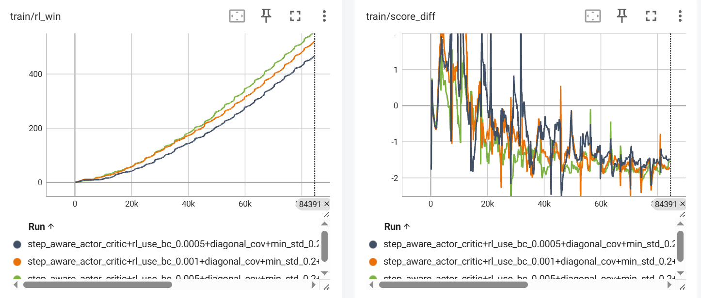
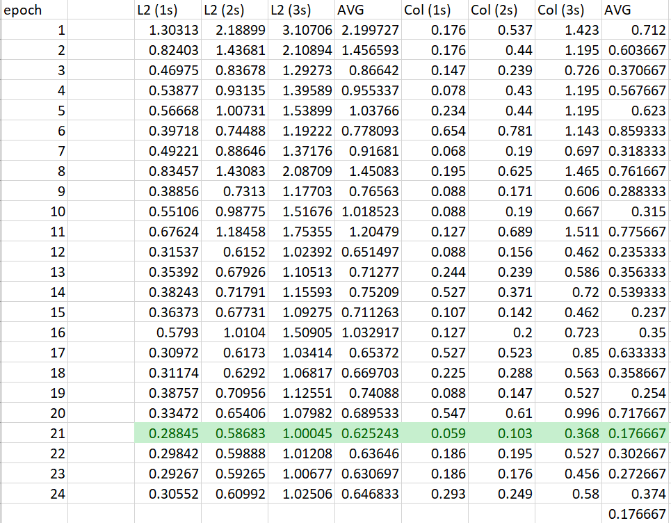

# CoIRL-AD: Collaborative–Competitive Imitation–Reinforcement Learning in Latent World Models for Autonomous Driving

<div align="center">
<a href="https://seu-zxj.github.io/">Xiaoji Zheng</a>*, 
<a href="https://ziyuan-yang.github.io">Yangzi Yuan</a>*, 
<a href="https://github.com/Ian-cyh">Yanhao Chen</a>, 
<a href="https://github.com/doraemonaaaa">Yuhang Peng</a>, 
<a href="https://github.com/TANGXTONG1">Yuanrong Tang</a>, 
<a href="https://openreview.net/profile?id=~Gengyuan_Liu1">Gengyuan Liu</a>, 

<a href="https://www.sigs.tsinghua.edu.cn/cbk/main.htm">Bokui Chen</a>‡ and 
<a href="https://air.tsinghua.edu.cn/en/info/1046/1477.htm">Jiangtao Gong</a>‡.
<div>
*: Equal contribution.
‡: Corresponding authors.
</div>

<div>
<a href="https://seu-zxj.github.io/CoIRL-AD"></a>
<a href="https://arxiv.org/abs/2510.12560"></a>
<a href="https://github.com/SEU-zxj/CoIRL-AD"></a>
<a href="https://huggingface.co/Student-Xiaoji/CoIRL-AD-models"></a>
</div>

</div>

**CoIRL-AD** introduces a dual-policy framework that unifies imitation learning (IL) and reinforcement learning (RL) through a collaborative–competitive mechanism within a latent world model.  
The framework enhances generalization and robustness in end-to-end autonomous driving without relying on external simulators.


## News
- **[2025.10.15]** We released our paper, code, ckpts and website.

## Installation
I really hate spend so much time on configuring environments, so here I have tried my best to shorten the configure steps.

And I also verified these steps after I finish the project, hope that saves your time :)

If you encountered any questions, feel free to raise an issue :)

1. create a conda virtual environment and activate it
```
conda create -n coirl python=3.8 -y # '-n' => '--name', '-y' => '--yes'
conda activate coirl
```

2. package installation in one line (if you succeed, go to 4.)
```
# cd CoIRL-AD (make sure the working directory is this repo)
bash ./setup_assistant.sh
```

3. package installation step by step (if you execute 2 successfully, skip this)

execute the following steps one by one:
```
# step 0: install packages from requirements.txt
pip install -r requirements.txt

# step 1: install torch
# make sure CUDA-11.1 has been installed, and set `export CUDA_HOME=/usr/local/cuda-11.1`
pip install torch==1.9.0+cu111 torchvision==0.10.0+cu111 torchaudio==0.9.0 -f https://download.pytorch.org/whl/torch_stable.html

# step 2: install mm-related packages
pip install mmcv-full==1.4.0 -f https://download.openmmlab.com/mmcv/dist/cu111/torch1.9.0/index.html
python -c "from mmcv.ops import nms; print('✅ mmcv ops imported OK')"
pip install mmdet==2.14.0 mmengine==0.10.7 mmsegmentation==0.14.1

# step 3: install mmdet3d (clone the repo and build locally)
# make sure your gcc is older THAN 10 (e.g. 9)
# if not, execute: `export CC=/usr/bin/gcc-9` and `export CXX=/usr/bin/g++-9`
# make sure working in /CoIRL-AD, this directory
pip install -e git+https://github.com/open-mmlab/mmdetection3d.git@f1107977dfd26155fc1f83779ee6535d2468f449#egg=mmdet3d

# step 4: install other packages
pip install timm==1.0.20

# step 5: use older setuptools to avoid bugs
pip install setuptools==59.5.0
```

4. download nuscenes datasets
Organize your dataset as follows:
```
CoIRL-AD
├── projects/
├── data/nuscenes
│   ├── can_bus/
│   ├── nuscenes/
│   │   ├── maps/
│   │   ├── samples/
│   │   ├── sweeps/
│   │   ├── v1.0-test/
│   │   ├── v1.0-trainval/
│   │   ├── vad_nuscenes_infos_temporal_train.pkl
│   │   ├── vad_nuscenes_infos_temporal_val.pkl
```
If you have downloaded nuscenes in other location, use simbolic link:
```
ln -s <source> <destination> # create a link between destination and source
```
5. download info files for dataloader

You can generate .pkl info files on your own via executing script `./tools/data_converter/vad_nuscenes_converter.py`.

We also provide the .pkl file we have generated for you, you can download from huggingface:

|  filename   | download link  |
|  ----  | ----  |
| `vad_nuscenes_infos_temporal_train.pkl`  | [link](https://huggingface.co/Student-Xiaoji/CoIRL-AD-models/blob/main/info-files/vad_nuscenes_infos_temporal_train.pkl) |
| `vad_nuscenes_infos_temporal_val.pkl`  | [link](https://huggingface.co/Student-Xiaoji/CoIRL-AD-models/blob/main/info-files/vad_nuscenes_infos_temporal_val.pkl) |

If you want to test the cross-city generalization ability of our model, we also provide info file spilt of nuscenes-singapore and nuscenes-boston (If not, just skip this step). We also provide long-tail scenarios info files so that you can also test the performance of our model in long-tail scenarios.

|  filename   | download link  |
|  ----  | ----  |
| `vad_nuscenes_infos_temporal_train_singapore.pkl`  | [link](https://huggingface.co/Student-Xiaoji/CoIRL-AD-models/blob/main/info-files/vad_nuscenes_infos_temporal_train_singapore.pkl) |
| `vad_nuscenes_infos_temporal_val_boston_seaport.pkl`  | [link](https://huggingface.co/Student-Xiaoji/CoIRL-AD-models/blob/main/info-files/vad_nuscenes_infos_temporal_val_boston_seaport.pkl) |
| `vad_nuscenes_infos_temporal_val_longtail_collision.pkl`  | [link](https://huggingface.co/Student-Xiaoji/CoIRL-AD-models/blob/main/info-files/vad_nuscenes_infos_temporal_val_longtail_collision.pkl) |
| `vad_nuscenes_infos_temporal_val_longtail_L2.pkl`  | [link](https://huggingface.co/Student-Xiaoji/CoIRL-AD-models/blob/main/info-files/vad_nuscenes_infos_temporal_val_longtail_L2.pkl) |


## Quick Start
To run our code quickly, the best way is to try run the inference code, see the results and visualize the results.
1. download ckpt of CoIRL-AD via this [link](http://huggingface.co/Student-Xiaoji/CoIRL-AD-models/blob/main/ckpts/CoIRL-AD/epoch_21.pth), or ckpt of LAW we trained on our machine via this [link](https://huggingface.co/Student-Xiaoji/CoIRL-AD-models/blob/main/ckpts/LAW/epoch_15.pth).
2. run inference code.

    2.1 open the config file `./projects/configs/coirl.py`

    2.2 set results save path at line 110-111:
    ```
    save_results_flag=True,
    results_path="results/coirl.pth"
    ```

    2.3 inference
    ```
    # evaluate CoIRL-AD on nuscenes eval set
    ./tools/dist_test.sh <path of configuration file coirl.py> <path of CoIRL-AD ckpt> <num-of-GPUs>
    # evaluate LAW on nuscenes eval set (you can skip)
    ./tools/dist_test.sh <path of configuration file law.py> <path of LAW ckpt> <num-of-GPUs>
    ```
3. visualize the results.
    3.1 the most simple way is to directly visualize the trajectory in `coirl.pth`, if you want to generate visualized figs and videos in our paper, see following steps.
    3.2 open `./projects/tools/visualization/vis_result_compare.py`
    3.3 configure path of `data_root`, `info_path`, and `output_result_path` (here you can ignore `baseline_result_path`)
    3.4 run the visualization script
    ```
    python path-of-vis_result_compare.py --save-path <directory-to-save-visualization-results>
    ```

## Training
We provide a training script file to hold the training code:
```
# make sure activate coirl enviroenment `conda activate coirl`
# make sure cd to directory `CoIRL-AD`
./tools/nusc_my_train.sh coirl/coirl <num-of-GPUs> coirl/first-run
```
The good news is our repo also support [LAW](https://github.com/BraveGroup/LAW) training:
```
# make sure activate coirl enviroenment `conda activate coirl`
# make sure cd to directory `CoIRL-AD`
./tools/nusc_my_train.sh law/law <num-of-GPUs> law/first-run
```

### Monitor Training Process
You can use Tensorboard easily monitor the training process.

For example, if you train your model via `./tools/nusc_my_train.sh coirl/coirl <num-of-GPUs> coirl/first-run`, then the training infomation will be stored at `./work_dirs/coirl/first_try`.

Use Tensorboard to visualize the intermediate variables during training:
```
tensorboard --logdir ./work_dirs/coirl
```


### Collecting Eval Metrics After Each Epoch
Be default, during training, the model will eval on the eval set after each epoch. The eval results will save into `.log` with other logging information.

We provide a useful script to collection the eval metrics after each epoch. After you finished training, find the `.log.json` file, copy its absolute path, and paste it as the value of variable `input_log_file` in `./tools/extract_val_log_to_xlsx.py`, then set the path to save the `.xlsx` file.

execute
```
python ./tools/extract_val_log_to_xlsx.py
```
to obtain the collected metrics table.



## Testing
We provide a eval script to hold the testing code:
```
# make sure activate coirl enviroenment `conda activate coirl`
# make sure cd to directory `CoIRL-AD`
./tools/dist_test.sh <absolute-path-of-config-file> <absolute-path-of-ckpt> <num-of-GPUs>
```
You can also evaluate [LAW](https://github.com/BraveGroup/LAW), just change the configure file to `./projects/configs/law/law.py`, and use LAW's ckpt.


## Results and Checkpoints
Here, we provide the ckpt and results of models we used in our paper.
|  Model   | training set | training epoch | ckpt epoch id | ckpt link  | results link |
|  ----  | ---- | ---- | ---- | ---- | ---- |
| CoIRL-AD  |  nuscenes  | 24 | 21 | [link](https://huggingface.co/Student-Xiaoji/CoIRL-AD-models/blob/main/ckpts/CoIRL-AD/epoch_21.pth) | [link](https://huggingface.co/Student-Xiaoji/CoIRL-AD-models/blob/main/ckpts/CoIRL-AD/results.pkl) |
| CoIRL-AD  |  nuscenes-singapore | 24 | 13 | [link](https://huggingface.co/Student-Xiaoji/CoIRL-AD-models/blob/main/ckpts/CoIRL-AD-sinapore/epoch_13.pth) | None |
| LAW  |  nuscenes  | 24 | 15 | [link](https://huggingface.co/Student-Xiaoji/CoIRL-AD-models/blob/main/ckpts/LAW/epoch_15.pth) | [link](https://huggingface.co/Student-Xiaoji/CoIRL-AD-models/blob/main/ckpts/LAW/results.pkl) |
| LAW  |  nuscenes-singapore | 24 | 13 | [link](https://huggingface.co/Student-Xiaoji/CoIRL-AD-models/blob/main/ckpts/LAW-sinapore/epoch_13.pth) | None |

The metrics of the four model above is as follows, the models trained on nuscenes singapore are evaluated on nuscenes-boston evaluation spilt set:
|  Model   | L2 (1s)  | L2 (2s)  | L2 (3s)  | L2 (avg)  | Col% (1s)  | Col% (2s)  | Col% (3s)  | Col% (avg)  | metrics file | 
|  ----  | ----  |  ----  | ----  |  ----  | ----  |  ----  | ----  |  ----  | ---- |
| CoIRL-AD  | 0.288 | 0.587 | 1.00 | 0.625 | 0.059 | 0.103 | 0.368 | 0.177 | [link](https://huggingface.co/Student-Xiaoji/CoIRL-AD-models/blob/main/ckpts/CoIRL-AD/eval_metrics.xlsx)
| CoIRL-AD (singapore)  | 0.326 | 0.653 | 1.127 | 0.702 | 0.038 | 0.152 | 0.463 | 0.218 | [link](https://huggingface.co/Student-Xiaoji/CoIRL-AD-models/blob/main/ckpts/CoIRL-AD-sinapore/eval_metrics.xlsx)
| LAW  | 0.322 | 0.627 | 1.030 | 0.660 | 0.088 | 0.122 | 0.456 | 0.222 | [link](https://huggingface.co/Student-Xiaoji/CoIRL-AD-models/blob/main/ckpts/LAW/eval_metrics.xlsx)
| LAW (singapore)  | 0.445 | 0.8846 | 1.463 | 0.931 | 0.133 | 0.428 | 1.497 | 0.686 | [link](https://huggingface.co/Student-Xiaoji/CoIRL-AD-models/blob/main/ckpts/LAW-sinapore/eval_metrics.xlsx)


## Visualization Tools
We provide visualization tools (derived from visualization code of VAD), however now the visualization code is slow. We encourage PRs use multiprocess methods to speed up visualization process.

To use the visualization code, you should first get the `results.pkl` outputted by the model you trained. Then configure the `output_result_path` in script `./projects/tools/visualization/vis_result_compare.py`.

If you want to visualize both trajectories planned by baseline model and the model you trained, configure the `baseline_result_path` in the script.

How to get the `results.pkl`? 

Before evaluate your model, in your configure file, set `save_results_flag` to `True` and `results_path` to the path you want to save the results file.

Then execute the visualization script:
```
python path-of-vis_result_compare.py --save-path <directory-to-save-visualization-results>
```

## Acknowlegdements
This project is derived from [LAW](https://github.com/BraveGroup/LAW), [SSR](https://github.com/PeidongLi/SSR), [WoTE](https://github.com/liyingyanUCAS/WoTE), [World4Drive](https://github.com/ucaszyp/World4Drive), [DreamerV3](https://github.com/danijar/dreamerv3), [RAD](https://github.com/hustvl/RAD), and so on. Thanks for these authors' fantastic work!

## Citations
If you find our work helpful, please consider cite our project:
```
@article{coirl-ad,
  title={},
  author={},
  journal={},
  year={}
}
```

